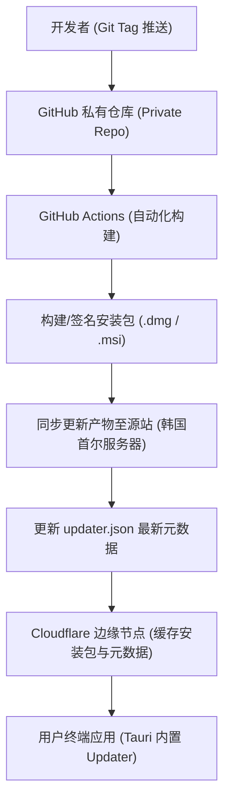

# Telepathy 版本发布与自动更新需求规格说明书 (Release & Updater Spec)

## 1. 引言

### 1.1 编写目的
本文档旨在为 Telepathy 桌面端应用（基于 Tauri v2 + Rust + Vue 3）制定一套完整的、适合闭源（私有仓库）商业化运作的**版本发布与自动更新（Auto-Updater）**技术规格说明书。

### 1.2 项目背景
Telepathy 是一款本地 AI 知识库桌面应用。随着业务迭代，需要快速、安全地将最新特性分发给用户。本方案结合 GitHub Actions（跨平台打包）、Cloudflare（边缘 CDN 缓存）以及韩国首尔自建服务器（低延迟存储源站），实现零成本/低成本的高可用应用更新推送。

---

## 2. 总体架构设计



---

## 3. 需求规格细则

### 3.1 跨平台打包与发布 (GitHub Actions)
*   **平台覆盖**：支持 macOS (aarch64 / Intel) 和 Windows (x86_64)。
*   **macOS 分发模式**：采用**无证书（不花钱）分发模式**。安装包直接提供给用户，在下载页附带如下终端执行指南：
    ```bash
    sudo xattr -rd com.apple.quarantine /Applications/Telepathy.app
    ```
*   **私密凭据管理**：所有打包与签名所用的密钥存放在 GitHub Secrets 中。
    *   `TAURI_SIGNING_PRIVATE_KEY`：Tauri 自动更新包签名私钥。
*   **触发条件**：向主分支（main）推送 `v*` 格式的 Git Tag 时自动触发发布流程。

### 3.2 文件托管与网络加速 (首尔服务器 + Cloudflare CDN)

#### A. 源站规格 (韩国首尔服务器)
*   **流量配额**：300 GB/月。
*   **带宽上限**：30 Mbps (峰值 3.75 MB/s)。
*   **网络延迟**：国内访问 30ms ~ 80ms。
*   **服务形态**：配置 Nginx 静态文件服务器，提供安装包和 `updater.json` 的访问入口。

#### B. 缓存策略 (Cloudflare)
*   **边缘节点缓存**：开启 Cloudflare Proxy（小云朵），配置 Page Rules 强制缓存安装包文件。
*   **突破流量限制**：将源站流量消耗降至接近 0（仅首次回源消耗流量），确保高并发下载时带宽不被挤满。
*   **HTTPS 支持**：由 Cloudflare 自动提供 SSL/TLS 证书。

---

## 4. 自动更新数据交互规格

### 4.1 终端请求地址 (Endpoint)
应用启动时，Tauri 自动向如下固定静态 JSON 文件发起请求：
```text
https://download.telepathy-app.com/releases/updater.json
```

### 4.2 数据格式 (`updater.json`)
当新版本（例如 `v1.1.0`）发布时，服务端返回的 JSON 数据结构规范如下：

```json
{
  "version": "1.1.0",
  "notes": "Telepathy v1.1.0 发布！支持了多项目本地向量化索引及主题色自适应功能。",
  "pub_date": "2026-05-04T15:00:00Z",
  "platforms": {
    "darwin-aarch64": {
      "signature": "dW50cnVzdGVkIGNvbW1lbnQ6IG1pbmlzaWduIHB1YmxpYyBrZXkKUldTS...",
      "url": "https://download.telepathy-app.com/releases/v1.1.0/Telepathy_1.1.0_aarch64.app.tar.gz"
    },
    "windows-x86_64": {
      "signature": "dW50cnVzdGVkIGNvbW1lbnQ6IG1pbmlzaWduIHB1YmxpYyBrZXkKUldTS...",
      "url": "https://download.telepathy-app.com/releases/v1.1.0/Telepathy_1.1.0_x64_en-US.msi.zip"
    }
  }
}
```

---

## 5. 前端交互与流程控制 (Tauri Plugin Updater)

1.  **自动检查**：应用每次启动时静默检查更新，不干扰用户正常使用。
2.  **强制更新与静默更新**：
    *   通过自定义弹窗提示用户有新版本可用；
    *   允许用户点击“暂不更新”或“立即下载并重启”。
3.  **异常捕获**：若由于网络阻断、CDN 回源超时等原因导致下载失败，需在设置页面提供“重试下载”或“手动访问网页下载”链接，确保用户始终有渠道完成升级。

---

## 6. 成功指标

1.  **首屏加载速度**：用户在国内下载安装包平均速度 > 5 MB/s（通过 CF 缓存）。
2.  **源站流量消耗**：首月下载次数达到 10,000 次时，韩国服务器真实消耗流量 < 5 GB。
3.  **零宕机**：由于配置了多级 CDN，即使韩国源站短时间宕机，已缓存的更新包仍能继续分发。
