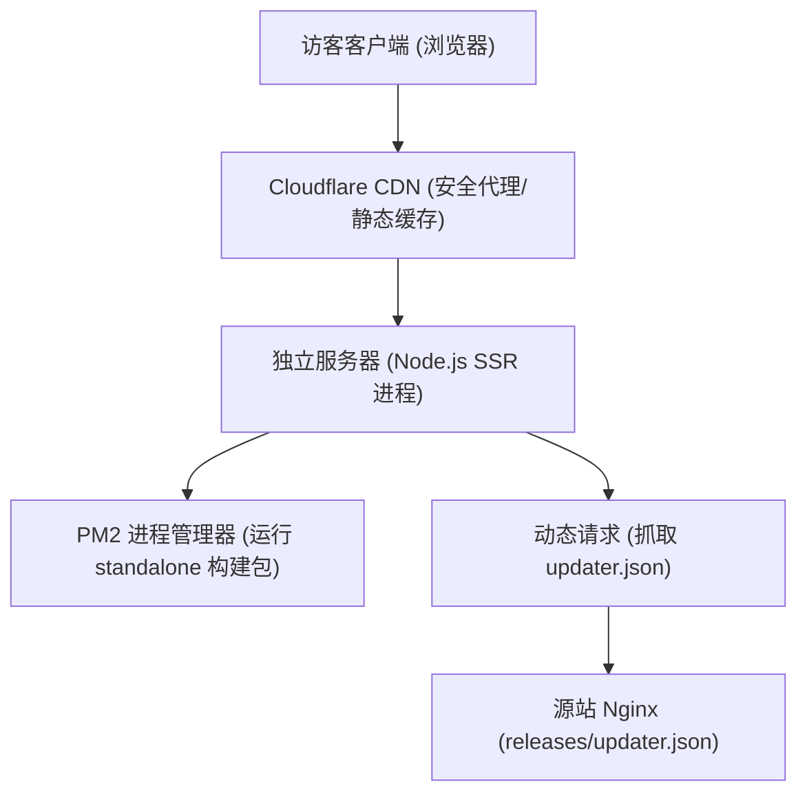

# Telepathy 官方网站设计规格说明书 (Telepathy Website Spec)

**日期**: 2026-05-20
**状态**: 提案已批准
**技术选型**: Next.js 15 (App Router) + React 19 + TypeScript + Tailwind CSS

---

## 1. 背景与建设目的

Telepathy 是一款基于 Tauri v2 + Vue 3 + Rust 构建的本地离线 AI 知识库桌面应用。随着产品发布在即，需要建设一个官方网站作为产品的分发入口和品牌门面。

官网核心目标包括：
1. **产品特征介绍**：以符合产品暗黑科技调性的高端视觉，展示 100% 隐私安全、多项目隔离、GPU 硬件加速、HNSW 向量检索、PDF 视觉解析、随笔工作台等核心卖点。
2. **多平台软件下载**：为 Windows (.msi)、macOS (.dmg) 和 Linux (.AppImage) 提供直观的下载入口。
3. **安装与安全引导**：由于 macOS 采用无证书打包，且 Linux 运行 AppImage 需要赋权，官网需要提供一键复制的命令指引，以降低用户安装门槛。
4. **版本同步自动化**：基于 Next.js 服务端渲染 (SSR)，自动抓取源站的 `updater.json`，实现“发版即同步”，免去手动维护官网下载链接的麻烦。

---

## 2. 总体架构设计

### 2.1 部署架构

官网将直接托管在用户的独立服务器上，并通过 Cloudflare 进行 CDN 代理与加速。



* **Next.js 独立包部署 (Standalone)**：在 `next.config.ts` 中配置 `output: 'standalone'`。在构建时，Next.js 会自动分析依赖，在 `.next/standalone` 中生成只包含必要运行环境的独立部署包，减小服务器部署体积并提高启动速度。
* **Cloudflare 边缘缓存**：开启 Cloudflare Proxy 代理，利用缓存规则（Page Rules）将网站的 JS、CSS 和公共图片等静态资源缓存在边缘节点。

### 2.2 数据同步架构

为了实现官网版本与打包发布系统的全自动同步，Next.js SSR 服务端将在生成页面时动态拉取最新版本信息：

```text
请求地址：https://download.telepathy-app.com/releases/updater.json
数据结构规范：
{
  "version": "X.Y.Z",
  "notes": "版本更新日志描述",
  "pub_date": "发布时间UTC",
  "platforms": {
    "darwin-aarch64": { "url": "..." },
    "darwin-x86_64": { "url": "..." },
    "windows-x86_64": { "url": "..." },
    "linux-x86_64": { "url": "..." } // 新增 Linux 平台
  }
}
```

* **SSR 缓存机制**：
  在 Next.js 的 Fetch 请求中配置重新验证时间（Revalidation Time）为 5 分钟：
  ```typescript
  const res = await fetch('https://download.telepathy-app.com/releases/updater.json', {
    next: { revalidate: 300 } // 5分钟内共享缓存，避免压垮源站
  });
  ```

---

## 3. 视觉设计系统与配色规范

官网将继承 Telepathy 桌面应用的深邃暗黑和霓虹科技风格，构建一致的高质感视觉体验。

### 3.1 调色板设计 (Tailwind 变量)

* **深色背景 (Background)**：
  * 主背景：`#070a13`（非常深邃的藏蓝黑色）
  * 渐变辅背景：径向渐变过渡至 `#0c1020`
* **前景色/卡片 (Card & Borders)**：
  * 磨砂卡片背景：`rgba(15, 23, 42, 0.45)` 配合 `backdrop-filter: blur(12px)`
  * 细描边：`border: 1px solid rgba(255, 255, 255, 0.05)`
* **霓虹高亮渐变 (Brand Accents)**：
  * 玫红到紫罗兰渐变：`from-rose-500 via-pink-500 to-violet-600`（用于主按钮、文字高亮）
* **文本色彩 (Typography)**：
  * 标题：`#ffffff` (或渐变微光)
  * 正文/描述：`#94a3b8` (淡灰蓝色)

### 3.2 字体配置
* 标题字体：使用 Google Fonts `Outfit` 字体，展现科技凌厉感。
* 正文字体：使用 Google Fonts `Inter` 字体，保证清晰易读。

---

## 4. 板块规划与交互细节

官网为单页响应式结构 (Single Page Application)，划分为以下 5 个核心板块：

### 4.1 顶部导航栏 (Navbar)
* **内容**：Telepathy 的 Logo 和文字标题；平滑锚点（"产品特性", "下载中心", "常见问题"）；Github 仓库跳转链接（图标按钮）。
* **特性**：半透明磨砂玻璃浮动置顶，具备滚动渐变阴影。

### 4.2 视觉首屏 (Hero Segment)
* **左侧**：
  * Slogan：**本地优先的个人 AI 智能知识库桌面应用** (Local-First Personal AI Knowledge Base)
  * 副标题：基于本地 LLM 驱动，100% 隐私安全，超强向量索引与多模态解析，打造您专属的本地第二大脑。
  * **智能下载主按钮**：
    * *特性*：【立即下载 {OS_Name} 版】（玫瑰红/紫罗兰渐变发光按钮）。
    * *系统检测*：在页面挂载时（`useEffect`），通过 `navigator.userAgent` 自动识别用户的操作系统（macOS / Windows / Linux）。
    * *动作*：
      * 若识别为 macOS，点击直接下载最新 `.dmg` 安装包；
      * 若识别为 Windows，点击直接下载最新 `.msi` / `.exe` 安装包；
      * 若识别为 Linux，点击直接下载最新 `.AppImage` 安装包；
      * 若未能识别或未挂载完成，降级显示通用的【立即下载最新版】（点击锚点平滑滚动至下载中心）。
  * 动态版本提示：下方以细微字体提示 `当前最新版本：v{Version} | 100% 离线隐私安全`。
* **右侧**：
  * 3D 应用截图 Mockup：利用 CSS 霓虹外发光阴影与 3D 旋转滤镜，将 Telepathy 对话或模型管理的主界面图制作成极具立体感的 Mockup。
  * 动效：使用 CSS `@keyframes` 触发微弱的 Y 轴上下漂浮动画（模拟磁悬浮效果，周期 5 秒）。

### 4.3 产品核心特性网格 (Features Grid)
以 3x2 磨砂玻璃卡片呈现：
1. **100% 本地隐私安全**：数据与问答完全在本地运行，断网可用，绝不上传任何隐私。
2. **多项目知识库隔离**：支持针对不同工作空间、学习领域创建隔离的项目向量索引，支持批量导入。
3. **极速向量检索 (HNSW)**：底层采用 HNSW 索引加速，毫秒级定位最相关的文档切片。
4. **多模态 PDF 视觉解析**：内置高级 OCR 视觉模型，支持复杂图表与 PDF 视觉解析，失败自动退回纯文本。
5. **本地原生推理引擎**：基于 `llama.cpp`，深度优化大模型加载与推理速度，支持主流 GPU 硬件加速。
6. **沉浸式随笔工作台**：内置双栏 Markdown 笔记，轻松随手记录思想，并与本地知识库深度关联。

### 4.4 跨平台下载中心 (Download Center)
当用户需要下载非当前系统的其他版本时，可在此下载中心获取。这里并排展示三个精美磨砂玻璃卡片：

#### 1) macOS 卡片
* **元素**：Apple 标志，支持平台（M1/M2/M3 Apple Silicon & Intel），下载后缀 `.dmg`。
* **状态标识**：若用户系统为 macOS，此卡片将带有淡粉色微光高亮边框和“当前系统”标识。
* **命令行引导**（解决无签名损坏报错）：
  ```bash
  sudo xattr -rd com.apple.quarantine /Applications/Telepathy.app
  ```
  内置【一键复制】按钮，复制成功后带有气泡提示。

#### 2) Windows 卡片
* **元素**：Windows 标志，支持平台（Windows 10/11 64位），下载后缀 `.msi` 或 `.exe`。
* **状态标识**：若用户系统为 Windows，此卡片将带有淡粉色微光高亮边框和“当前系统”标识。
* **说明**：点击直接获取最新安装程序。

#### 3) Linux 卡片
* **元素**：Linux 标志，支持平台（x86_64 架构主流发行版），下载后缀 `.AppImage`。
* **状态标识**：若用户系统为 Linux，此卡片将带有淡粉色微光高亮边框和“当前系统”标识。
* **命令行引导**（解决运行赋权问题）：
  ```bash
  chmod +x Telepathy-x86_64.AppImage
  ```
  内置【一键复制】按钮。

### 4.5 常见问题 (FAQ)
使用交互式的 Accordion（折叠面板）实现：
* Q: 本地运行需要什么电脑配置？
  * A: 推荐 8GB 内存以上，若有 NVIDIA 显卡或 Apple M 系列芯片体验最佳。
* Q: 为什么 macOS 打开提示“文件已损坏”？
  * A: 详情参见下载中心的终端解锁指令，在终端中一键绕过隔离区策略即可正常运行。
* Q: 支持哪些格式的文档？
  * A: 支持 PDF、Markdown、TXT，即将支持 Word、Excel 及网页爬取。

---

## 5. 项目工程结构与核心配置规范

### 5.1 `next.config.ts`
配置独立进程输出，有利于在独立 Linux 服务器上利用 PM2 部署：
```typescript
import type { NextConfig } from "next";

const nextConfig: NextConfig = {
  output: "standalone",
  images: {
    remotePatterns: [
      {
        protocol: "https",
        hostname: "download.telepathy-app.com",
      },
    ],
  },
};

export default nextConfig;
```

### 5.2 核心样式配置 (`globals.css`)
```css
@tailwind base;
@tailwind components;
@tailwind utilities;

@layer base {
  body {
    background-color: #070a13;
    color: #f8fafc;
    font-family: 'Inter', sans-serif;
    background-image: 
      radial-gradient(circle at 10% 20%, rgba(244, 63, 94, 0.05) 0%, transparent 40%),
      radial-gradient(circle at 90% 80%, rgba(139, 92, 246, 0.05) 0%, transparent 40%);
    background-attachment: fixed;
  }
}

/* 霓虹发光文字与特效 */
.text-gradient {
  background: linear-gradient(135deg, #f43f5e 0%, #a855f7 50%, #3b82f6 100%);
  -webkit-background-clip: text;
  -webkit-text-fill-color: transparent;
}

/* 玻璃拟态卡片 */
.glass-card {
  background: rgba(15, 23, 42, 0.45);
  backdrop-filter: blur(12px);
  border: 1px solid rgba(255, 255, 255, 0.05);
  transition: all 0.3s cubic-bezier(0.4, 0, 0.2, 1);
}

.glass-card:hover {
  border-color: rgba(244, 63, 94, 0.2);
  box-shadow: 0 10px 30px -10px rgba(244, 63, 94, 0.15);
  transform: translateY(-2px);
}

/* 模拟悬浮动效 */
@keyframes float {
  0%, 100% { transform: translateY(0px) rotate(1deg); }
  50% { transform: translateY(-10px) rotate(-1deg); }
}

.animate-float {
  animation: float 5s ease-in-out infinite;
}
```

---

## 6. 成功与验收指标

1. **版本自动同步**：更新源站的 `updater.json` 后的 5 分钟内，官网上的下载版本和链接必须自动变化。
2. **移动端响应式友好**：在手机、平板与超宽屏幕下展示正常，无横向滚动条，内容自动排版。
3. **加载速度**：在 Cloudflare 代理下，首屏（LCP）加载时间应 < 1.5 秒。
