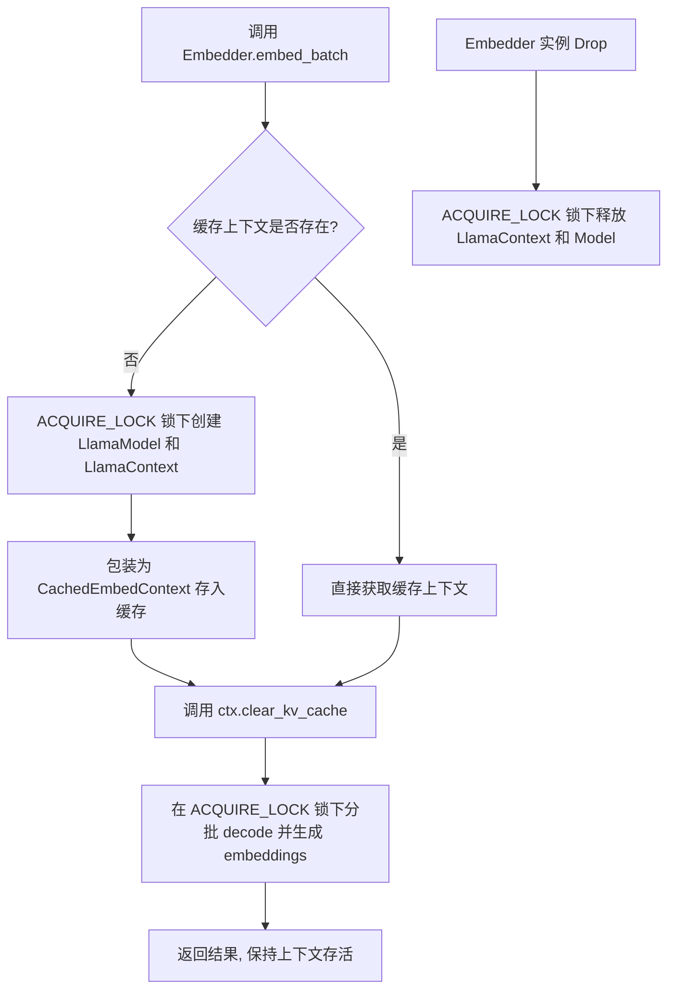

# 多模型同时下载与向量化服务（Embedder）闪退修复设计

本项目旨在修复高级 Office 文档导入/向量化过程中的 GPU 释放导致的闪退问题，并扩展系统以支持多模型并行下载与状态追踪。

## 1. 向量化服务 (Embedder) 闪退修复设计

### 1.1 根因分析
在目前的设计中，`Embedder::embed_batch` 为每一次分块调用都会重新初始化并销毁 `LlamaContext`。在导入 Word/PDF 等大文件时，该操作会短时间内在非主线程（tokio 阻塞线程）中以极高频率重复执行，引起 Metal/GPU 驱动的频繁分配与并发释放冲突。这通常会导致 llama.cpp 底层库在 deallocating 时由于 Race Condition 产生 `SIGABRT` 或 崩溃。

### 1.2 缓存与生命周期重构
在 [embedder.rs](file:///Users/mac/project/telepathy/src-tauri/src/services/embedder.rs) 中实现重用：
1. **上下文缓存结构**：定义 `CachedEmbedContext` 包装 `LlamaContext<'static>` 和对应的 `LlamaModel` 强引用，并手动实现 `Send` 与 `Sync`。
2. **重用逻辑**：`Embedder` 结构持有 `Arc<std::sync::Mutex<Option<CachedEmbedContext>>>`。每次生成向量前，检查缓存是否已存在。如果存在，直接调用 `ctx.clear_kv_cache()` 清理之前的 KV 缓存状态并重用，而不进行重新加载。
3. **安全析构**：实现 `Drop` 特征，在释放 `Embedder` 时，在全局互斥锁 `ACQUIRE_LOCK` 保护下显式将 `CachedEmbedContext` 置为 `None`，确保 Metal 上下文资源被串行销毁。



---

## 2. 同时下载多模型功能设计

### 2.1 后端状态与取消机制
后端 [models.rs](file:///Users/mac/project/telepathy/src-tauri/src/commands/models.rs) 和 [downloader.rs](file:///Users/mac/project/telepathy/src-tauri/src/services/model_hub/downloader.rs) 已使用 `DownloadManagerState` (由 `HashMap<String, CancellationToken>` 组成) 来管理每一个下载任务。
*   `install_model` 已经通过独特的 `registration_id` (如 `qwen2.5:7b-instruct`) 标识并允许并发调用。
*   `cancel_pull_model(model: Option<String>)` 已经支持传入特定模型标识来精准取消指定任务。
因此，后端机制已天然支持多模型并发下载，重构的核心在于前端状态收集与 UI 展示。

### 2.2 前端状态管理器重构 ([settings.ts](file:///Users/mac/project/telepathy/src/stores/settings.ts))
将目前单任务的管理机制重构为基于任务 Map 的多任务管理机制：
1. **新增状态**：
   ```ts
   // 正在下载的任务 Map，Key 为 model_id (如 "qwen:latest")
   const activeDownloads = ref<Record<string, ModelPullProgress>>({});
   ```
2. **全局事件监听**：
   在 Pinia Store 初始化或应用加载时，注册对 `model-pull-progress`、`model-pull-error`、`model-pull-done` 事件的全局监听，不再动态注册/注销，避免事件监听冲突和覆盖：
   *   `model-pull-progress`: 更新 `activeDownloads.value[model]`。
   *   `model-pull-error`: 弹出 Toast 错误，触发系统通知并清理 `activeDownloads.value[model]`。
   *   `model-pull-done`: 弹出完成通知，触发播放音效，更新已下载模型列表，并清理 `activeDownloads.value[model]`。
3. **状态导出与兼容**：
   *   保留并计算 `installingModel` 和 `installProgress` 作为 Computed 属性，返回 `activeDownloads` 的首个元素，确保未重构的组件功能不受影响。
   *   更新 `cancelInstall(modelId?: string)` 接口，允许根据指定的 `modelId` 调用后端取消指令。

### 2.3 前端 UI 面板重构 ([AppLayout.vue](file:///Users/mac/project/telepathy/src/components/layout/AppLayout.vue))
升级右下角的下载状态指示面板：
*   **状态隐藏/显示**：只有在 `Object.keys(settingsStore.activeDownloads).length > 0` 时显示。
*   **折叠状态下**：
    *   若有 1 个任务，显示 `"{modelName} {percentage}% 下载中"`。
    *   若有多个任务，显示 `"X 个模型下载中..."`。
*   **展开状态下**：
    *   以列表垂直堆叠形式展示每一个任务。
    *   每个任务卡片包含：模型标识、阶段说明（如 `Downloading...` ）、进度条百分比、当前大小进度、以及独立的 **“❌” 取消按钮**。
    *   面板有最大高度与 `overflow-y-auto` 滚动条，确保在下载大量模型时界面不会撑爆。

---

## 3. 验证方案

### 3.1 向量化稳定性测试
*   **自动化测试**：执行多文档并发解析或大文档全量解析测试，确认控制台没有 `ggml_metal_free: deallocating` 带来的 Abort，并且日志中只有在首次加载时输出 pipeline 编译，后续全部重用。

### 3.2 并行下载功能测试
*   **多模型并发下载测试**：在界面上点击下载 2 个及以上的模型。
*   **UI 渲染测试**：验证右下角悬浮窗能列出所有正在下载的模型的各自进度。
*   **精准取消测试**：点击其中一个下载任务 of 取消按钮，确认该任务被精准中断并清理，而其他下载任务正常不受影响。
